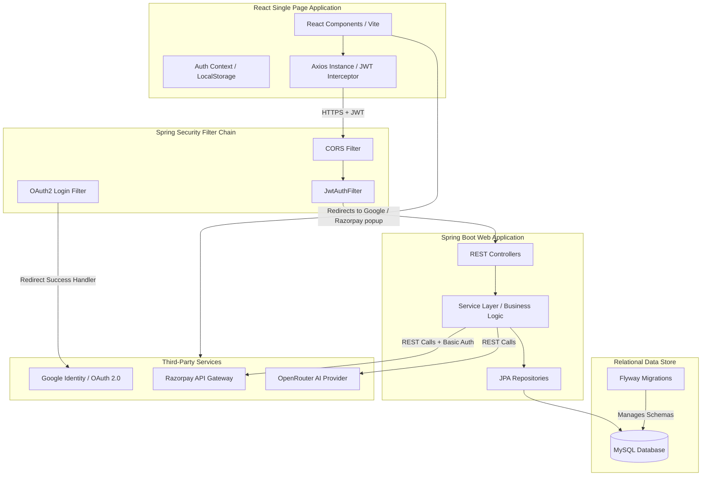
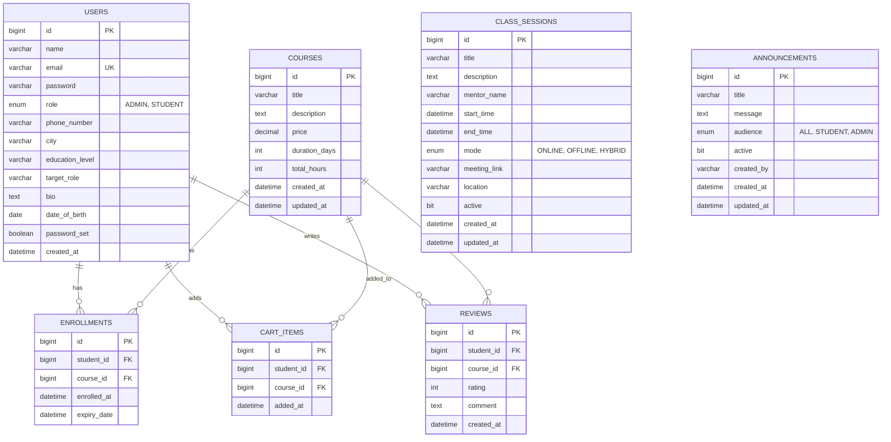

# BinaryStack Coaching Portal — Interview Preparation Guide

This guide is designed to help you explain the **BinaryStack Coaching Portal** in detail to a technical interviewer. It covers the project architecture, relational database design, deep-dives into core integrations (Google OAuth2, Razorpay Payment Gateway, AI Assistant), and a comprehensive bank of technical interview questions with deep explanations.

---

## 1. System Architecture & Tech Stack

The project is built as a decoupled full-stack application using a **Single-Page Application (SPA) frontend** and a **RESTful micro-framework backend**.

### Architectural Overview



### The Tech Stack Choice: Rationale
*   **Backend: Spring Boot (Java 17) + Spring Security (JWT) + JPA/Hibernate**:
    *   *Why Java 17?* Leverages modern features like records, text blocks, and improved garbage collection.
    *   *Why Spring Boot?* Fast setup, auto-configuration, and robust production-ready ecosystems for MVC, REST API creation, and database connections.
    *   *Why JPA/Hibernate?* Object-Relational Mapping (ORM) abstracting SQL queries into object interactions, boosting development speed.
*   **Database: MySQL + Flyway**:
    *   *Why MySQL?* Highly stable, relational, transaction-safe (ACID compliant) database.
    *   *Why Flyway?* Version-controlled database schema migrations. Avoids manual database changes across local development and production.
*   **Frontend: React + Vite + TailwindCSS + Axios**:
    *   *Why React?* Component-driven development, virtual DOM rendering, and single-state management.
    *   *Why Vite?* Significantly faster hot-rebuild times compared to Webpack.
    *   *Why TailwindCSS?* Utility-first styling enabling fast, responsive layouts.
    *   *Why Axios?* Built-in request/response interceptors, automatic JSON transformation, and robust error management.

---

## 2. Relational Database Schema Design

The application uses an InnoDB MySQL database. Transactions are managed via JPA's entity manager and Flyway migration scripts.



### Key Relationships & Data Integrity Constraints:
1.  **Unique Composite Constraints**: 
    *   `uk_enrollments_student_course (student_id, course_id)`: Prevents a student from enrolling in the same course twice.
    *   `uk_cart_items_student_course (student_id, course_id)`: Prevents duplicate course items in a student's cart.
    *   `uk_reviews_student_course (student_id, course_id)`: Ensures a student can write exactly one review per course.
2.  **Cascade Delete Rules**:
    *   In `reviews`, `ON DELETE CASCADE` is set for foreign keys targeting `users` and `courses` so reviews clean up automatically if a course or user is deleted.
    *   In the Spring Boot application, course deletion programmatically cleans up corresponding enrollments first to ensure safety against foreign key constraints in the database.

---

## 3. Integration Deep Dive & Working Mechanism

Here, we detail the step-by-step working mechanics and actual source code of the three core integrations: **Google OAuth2**, **Razorpay Payments**, and the **AI Assistant**.

---

### 3.1 Google OAuth2 Authentication

Google OAuth2 allows users to securely log in using their Google Accounts. Instead of storing passwords, the application delegates identity verification to Google.

#### Flow Diagram

```
[React Frontend]                       [Spring Security Backend]                    [Google OAuth Service]
       |                                           |                                           |
       |--- 1. Click "Login with Google" --------->|                                           |
       |    (URL: /oauth2/authorization/google)    |                                           |
       |                                           |--- 2. Redirect User for Consent --------->|
       |                                           |<-- 3. Enter Credentials & Approve --------|
       |                                           |                                           |
       |                                           |<-- 4. Authorization Code Redirect --------|
       |                                           |                                           |
       |                                           |--- 5. Exchange Code for Access Token ---->|
       |                                           |<-- 6. Retrieve User profile details ------|
       |                                           |                                           |
       |                                           |--- 7. Find or Create User Record ---------|
       |                                           |--- 8. Generate App JWT Token -------------|
       |<-- 9. Redirect to Frontend with JWT ------|                                           |
       |    (URL: /oauth2/redirect?token=jwt)      |                                           |
       |                                           |                                           |
       |--- 10. Load Profile & Set Auth Headers -->|                                           |
       |--- 11. (If new user) Prompt password ---->|                                           |
```

#### Step-by-Step Execution:
1.  **Initiation**: The student clicks "Login with Google" on the UI. The frontend redirects to the backend at: `${API_URL}/oauth2/authorization/google`.
2.  **Handshake**: Spring Security's `oauth2Login()` filter catches this request, matches the client configurations (Client ID, Redirect URL), and redirects the user to Google’s OAuth 2.0 consent page.
3.  **Authentication**: The user logs in to Google and approves request scopes (`email`, `profile`).
4.  **Authorization Code Callback**: Google redirects the browser back to the backend's default callback: `/login/oauth2/code/google` along with an temporary authorization code.
5.  **Access Token & User Details exchange**: Spring Security exchanges the code directly with Google for an access token and queries Google's User Info endpoint to retrieve user attributes (`email`, `name`).
6.  **Success Handler Execution**: The control flow enters the custom `Oauth2AuthenticationSuccessHandler`:
    *   It checks the `email` from Google.
    *   If the user exists in our DB, it continues. If not, it programmatically creates a new user database record with `Role.STUDENT`, sets a temporary randomized password, and flags `passwordSet = false`.
    *   It generates a local **JWT token** utilizing the database details of the user.
    *   It redirects the user back to the React frontend path: `/oauth2/redirect?token=<JWT_TOKEN>`.
7.  **Client-Side Capture**: The React router handles `/oauth2/redirect`, reads the token parameter, saves it to `localStorage`, and fetches user details.
8.  **First-Time Password Setting**: In `OAuth2RedirectHandler.jsx`, if the user has `passwordSet === false`, they are prompted to configure a new password. Doing so updates `passwordSet = true` in the database, enabling them to log in via standard email/password or Google OAuth in the future.

#### Explaining the Success Handler Code:
```java
// Oauth2AuthenticationSuccessHandler.java
@Override
public void onAuthenticationSuccess(HttpServletRequest request,
                                    HttpServletResponse response,
                                    Authentication authentication) throws IOException, ServletException {
    OAuth2User oAuth2User = (OAuth2User) authentication.getPrincipal();
    String email = oAuth2User.getAttribute("email");
    String name = oAuth2User.getAttribute("name");

    if (email == null) {
        getRedirectStrategy().sendRedirect(request, response, frontendUrl + "/login?error=email_not_provided");
        return;
    }

    String normalizedEmail = email.trim().toLowerCase(Locale.ROOT);

    // Dynamic sign-up or sign-in database sync
    User user = userRepository.findByEmail(normalizedEmail).orElse(null);
    if (user == null) {
        user = new User();
        user.setName(name != null ? name.trim() : "Google Learner");
        user.setEmail(normalizedEmail);
        user.setPassword(passwordEncoder.encode(UUID.randomUUID().toString())); // Random Hash
        user.setRole(Role.STUDENT);
        user.setPasswordSet(false); // Flag first login password setup prompt
        userRepository.save(user);
    }

    // Generate JWT token from our local database user profile details
    UserDetails userDetails = userDetailsService.loadUserByUsername(user.getEmail());
    String token = jwtUtil.generateToken(userDetails);

    String targetUrl = frontendUrl + "/oauth2/redirect?token=" + token;
    getRedirectStrategy().sendRedirect(request, response, targetUrl);
}
```

---

### 3.2 Razorpay Payment Gateway (Demo / Sandbox)

The system supports enrollments through direct free checkouts or paid checkouts via **Razorpay API Sandbox**. It is integrated for individual courses and cart checkout transactions.

#### Flow Diagram

```
[React Frontend]                      [Spring Boot Backend]                     [Razorpay Servers]
       |                                        |                                        |
       |--- 1. Click paid checkout ------------>|                                        |
       |                                        |--- 2. Call Razorpay API (POST /orders)-->|
       |                                        |<-- 3. Returns Order ID ----------------|
       |<-- 4. Returns JSON Order Details ------|                                        |
       |                                        |                                        |
       |--- 5. Initialize Razorpay SDK Modal ---|                                        |
       |--- 6. Complete Sandbox Payment --------|                                        |
       |<-- 7. Returns payment credentials -----|                                        |
       |    (order_id, payment_id, signature)   |                                        |
       |                                        |                                        |
       |--- 8. Call /verify API with signature->|                                        |
       |                                        |--- 9. Query Order Details -------------|
       |                                        |--- 10. Generate Backend Hash ----------|
       |                                        |--- 11. Compare Backend vs Razorpay Hash|
       |                                        |--- 12. Create DB Enrollment -----------|
       |<-- 13. Returns HTTP 200 Enrollment ----|                                        |
```

#### Step-by-Step Execution:
1.  **Order Creation**:
    *   The student clicks "Pay & Enroll" (for a course) or "Checkout" (for their cart).
    *   The frontend calls POST `/api/payments/razorpay/order` with the student ID and course ID.
    *   The backend validates that the student is not already enrolled. It multiplies the course price (in INR) by **100** to convert it to **Paise** (Razorpay requirement: `INR 500.00` = `50000 Paise`).
    *   The backend calls the Razorpay API (`https://api.razorpay.com/v1/orders`) using standard **HTTP Basic Authentication** (credentials encoded as `Base64(KeyID:KeySecret)`).
    *   Razorpay generates a global order reference. The backend receives the Order ID, stores it, and passes it to the frontend.
2.  **SDK Payment Popup**:
    *   The frontend dynamically loads the script `https://checkout.razorpay.com/v1/checkout.js`.
    *   It opens the Razorpay modal, passing variables like `key_id`, `amount`, `order_id`, and callback handlers.
    *   The student completes the demo payment in the sandbox screen.
3.  **Callback Response**:
    *   Upon completion, the Razorpay SDK returns `razorpay_order_id`, `razorpay_payment_id`, and `razorpay_signature`.
4.  **Verification**:
    *   The frontend redirects these variables to the backend verification endpoint `/api/payments/razorpay/verify`.
    *   The backend pulls details directly from the Razorpay API to confirm the amount and currency matched the initial enrollment requests.
    *   **Cryptographic HMAC Signature Verification**:
        *   The backend concatenates: `orderId + "|" + paymentId`.
        *   It hashes this payload using **HMAC SHA-256** using the secret API Key (`app.razorpay.key-secret`).
        *   It converts the hash to a hex-encoded string and performs a safe constant-time comparison against `razorpay_signature`.
    *   **Enrollment**: Once verified, the backend calls the database repository to create enrollment records for the user and returns success.

#### Cryptographic Signature Verification Code:
```java
// RazorpayPaymentService.java
public EnrollmentDto verifyPaymentAndEnroll(RazorpayVerifyRequest request) {
    User student = getStudent(request.getStudentId());
    Course course = getCourse(request.getCourseId());

    // 1. Verify existence of the order on Razorpay servers directly
    JsonNode orderDetails = fetchOrderDetails(request.getRazorpayOrderId());
    validateOrderDetails(orderDetails, request.getStudentId(), request.getCourseId(), toPaise(course.getPrice()));

    // 2. Validate cryptographic payload integrity
    String expectedSignature = generateSignature(request.getRazorpayOrderId(), request.getRazorpayPaymentId());
    if (!signaturesMatch(expectedSignature, request.getRazorpaySignature())) {
        throw new BadRequestException("Payment verification failed. Cryptographic mismatch.");
    }

    log.info("Razorpay payment verified for student {} and course {}", student.getId(), course.getId());
    return enrollmentService.enroll(request.getStudentId(), request.getCourseId());
}

private String generateSignature(String orderId, String paymentId) {
    try {
        String payload = orderId + "|" + paymentId;
        Mac mac = Mac.getInstance("HmacSHA256");
        mac.init(new SecretKeySpec(keySecret.getBytes(StandardCharsets.UTF_8), "HmacSHA256"));
        byte[] digest = mac.doFinal(payload.getBytes(StandardCharsets.UTF_8));
        return toHex(digest); // Conversion to hex-encoded signature
    } catch (Exception ex) {
        throw new BadRequestException("Failed to validate payment signature.");
    }
}

private boolean signaturesMatch(String expected, String actual) {
    // Constant time comparison to prevent timing side-channel attacks
    return MessageDigest.isEqual(
            expected.getBytes(StandardCharsets.UTF_8),
            actual.getBytes(StandardCharsets.UTF_8)
    );
}
```

---

### 3.3 Personalized AI Assistant (with Fallback Logic)

The AI assistant provides personalized mentorship. The backend queries student metadata dynamically and injects it as system prompt context before calling OpenRouter AI API endpoints.

#### How It Works:
1.  **Student Context Extraction**:
    *   When a request comes in, the backend reads the current session's JWT.
    *   It fetches the student profile: name, city, education level, target role, and active enrolled courses.
2.  **System Prompt Construction**:
    *   It creates a structured prompt starting with system guidelines: `"You are a concise programming tutor. Answer briefly."`
    *   It appends student details: name, target career goals, and active courses.
    *   It prompts the AI model: `"Please address the student directly by name and tailor your response to their background (education level, target role, and active courses) where relevant."`
3.  **OpenRouter Client Execution & Robust Model Fallback**:
    *   The primary model configured is queried (e.g., `openai/gpt-5.2`).
    *   If OpenRouter returns **HTTP 404 (Model Not Found/Unavailable)**, the system loops over a configurable array of `fallback-models` (e.g., `openai/gpt-4o-mini`, `mistralai/mistral-7b-instruct:free`).
    *   If OpenRouter returns **HTTP 402 (Insufficient Balance)** or **HTTP 401 (Unauthorized)**, the application intercepts the status, logs diagnostics, and returns user-friendly, descriptive messages instead of failing silently or throwing standard Null Pointer exceptions.

#### Prompt Engineering & Fallback Code:
```java
// AiService.java
public AiResponse ask(String query) {
    User user = getAuthenticatedUser();
    StringBuilder promptBuilder = new StringBuilder();
    promptBuilder.append("You are a concise programming tutor. Answer briefly.\n");
    
    if (user != null && user.getRole() == Role.STUDENT) {
        promptBuilder.append("Student Profile Context:\n")
                .append("- Name: ").append(user.getName()).append("\n")
                .append("- Education Level: ").append(user.getEducationLevel()).append("\n")
                .append("- Target Role: ").append(user.getTargetRole()).append("\n");
        
        List<Enrollment> enrollments = enrollmentRepository.findByStudent(user);
        if (enrollments != null && !enrollments.isEmpty()) {
            promptBuilder.append("- Enrolled Courses: ");
            String enrolledTitles = enrollments.stream()
                .map(e -> e.getCourse().getTitle())
                .collect(Collectors.joining(", "));
            promptBuilder.append(enrolledTitles).append("\n");
        }
        promptBuilder.append("Please address the student directly by name and tailor your response to their background.\n");
    }
    
    promptBuilder.append("\nUser Q: ").append(query);
    String prompt = promptBuilder.toString();

    // Model fallback sequence
    List<String> modelsToTry = new ArrayList<>();
    modelsToTry.add(primaryModel);
    modelsToTry.addAll(fallbackModels);

    for (String modelName : modelsToTry) {
        try {
            String answer = requestAnswer(modelName, prompt);
            return new AiResponse(answer);
        } catch (RestClientResponseException ex) {
            int status = ex.getStatusCode().value();
            if (status == 404) {
                log.warn("Model '{}' unavailable (404). Trying next model.", modelName);
                continue; // Loop continues to attempt next fallback model
            }
            if (status == 401) {
                return new AiResponse("OpenRouter auth failed (HTTP 401). Check server API Key.");
            }
            if (status == 402) {
                return new AiResponse("Insufficient OpenRouter credits (HTTP 402).");
            }
            return new AiResponse("Request failed (HTTP " + status + ").");
        }
    }
    return new AiResponse("All configured AI models are currently unavailable.");
}
```

---

## 4. Key Interview Questions & Answers

Be prepared to answer these questions confidently using technical vocabulary:

### 4.1 System & Database Security

#### Q1: How did you implement authentication and security across the backend APIs?
> **Answer**: I used **Spring Security 6** configured with a stateless session policy and stateless JWT verification.
> *   All requests pass through a custom filter (`JwtAuthFilter`) extending `OncePerRequestFilter`.
> *   This filter extracts the `Authorization: Bearer <token>` header, parses and verifies the signature using a secure HMAC key, and retrieves user permissions (roles).
> *   If the token is valid, it puts an `UsernamePasswordAuthenticationToken` context into Spring's security holder context: `SecurityContextHolder.getContext().setAuthentication(auth)`.
> *   Endpoints are secured based on roles (`STUDENT`, `ADMIN`) using `.requestMatchers("/api/admin/**").hasRole("ADMIN")` declarations.

#### Q2: How did you verify the payments from Razorpay securely? Why can’t we verify payments on the frontend?
> **Answer**: Verifying payments on the client-side (frontend) is unsafe because HTTP responses can be easily faked or intercepted. A user could modify JavaScript variables to mimic a successful payment.
> *   To prevent this, the backend performs **cryptographic verification**. Razorpay sends a hash called `razorpay_signature` alongside the payment payload details.
> *   The backend creates a local message payload by joining the `order_id` and the `payment_id` separated by a pipe (`|`): `orderId + "|" + paymentId`.
> *   Using **HMAC SHA-256** and the secret key (`key-secret`) stored safely in server configuration properties, the backend generates an expected signature.
> *   We use `MessageDigest.isEqual` to compare the expected and actual signatures. This method runs in constant time to prevent timing side-channel attacks.
> *   Once verification passes, we fetch order details from Razorpay's API to confirm the currency and amount matched the initial database prices before enrolling the user.

#### Q3: What is a timing side-channel attack on string comparisons, and how does `MessageDigest.isEqual` mitigate it?
> **Answer**: Standard string comparison methods (like `String.equals()`) compare characters one by one. They exit early as soon as they find a mismatch.
> *   An attacker can measure the time it takes for the server to reject a signature. If the first character matches, the API response will take slightly longer to fail than if the first character was incorrect. By testing different characters and measuring response times down to milliseconds, attackers can systematically deduce the signature.
> *   `MessageDigest.isEqual` prevents this timing side-channel attack by performing a character-by-character comparison of all characters in the string, regardless of where a mismatch occurs. This ensures the execution time is constant, hiding timing differences from the attacker.

#### Q4: How is database security managed, especially concerning passwords and SQL injections?
> **Answer**: 
> *   **SQL Injection Prevention**: We use **Spring Data JPA** repositories. Hibernate handles parameter binding natively by compiling SQL statements with placeholders (PreparedStatement queries). User input is never concatenated directly into SQL queries, neutralizing SQL injection attempts.
> *   **Password Hashing**: Raw passwords are never stored in the database. We use **BCrypt** (`BCryptPasswordEncoder`) with a strength parameter of 10. BCrypt incorporates a random salt natively inside the resulting hash string, defending against pre-computed hash lookup attacks (Rainbow Table attacks).

---

### 4.2 Spring Boot & JPA/Hibernate Questions

#### Q5: What is Hibernate's N+1 Query Problem, and how do you resolve it?
> **Answer**: The N+1 query problem occurs when JPA fetches a list of parent entities (1 query) and then makes individual queries to fetch child entities for each parent (N queries). This leads to `N + 1` total database roundtrips.
> *   For example, fetching all enrollments:
>     `List<Enrollment> enrollments = enrollmentRepository.findAll();`
>     If lazy loading is active, accessing `enrollment.getStudent().getName()` on each item generates a separate database query for each student.
> *   **Resolution**: We resolve this by using **Join Fetch** JPQL queries:
>     ```java
>     @Query("SELECT e FROM Enrollment e JOIN FETCH e.student JOIN FETCH e.course")
>     List<Enrollment> findAllWithStudentAndCourse();
>     ```
>     This tells Hibernate to fetch the parent and child entities in a single SQL query using `LEFT OUTER JOIN`s.

#### Q6: Explain `@Transactional` annotation in Spring. How does Spring manage transactions under the hood?
> **Answer**: `@Transactional` ensures that a set of database operations execute within a single transaction boundary. If any step fails or throws a runtime exception, the transaction is automatically rolled back, preserving database integrity.
> *   **Under the hood**: Spring uses dynamic AOP (Aspect-Oriented Programming) proxies. When a method annotated with `@Transactional` is called, the Spring container intercepts the call, starts a database transaction via a Transaction Manager, executes the method body, and commits the transaction. If a `RuntimeException` is thrown, Spring calls a rollback on the database connection.

#### Q7: How does Flyway manage migrations, and why is `ddl-auto` set to `validate` in production?
> **Answer**: Flyway records migration history in a table named `flyway_schema_history`. When the app boots, Flyway scans the `db/migration` folder for new SQL migration scripts. It compares these scripts with the history table, executes any new migrations sequentially, and records their checksums.
> *   We set `spring.jpa.hibernate.ddl-auto` to `validate` in production because options like `update` or `create-drop` can make accidental changes to production tables or erase data. Setting it to `validate` ensures Hibernate only checks that the Java entity models match the existing database schema, preventing accidental schema modifications.

---

### 4.3 React & Frontend Architecture

#### Q8: How did you implement route protection on the frontend (React)?
> **Answer**: I built a wrapper component called `ProtectedRoute`. It accesses the authentication state using our custom `useAuth()` context hook.
> *   If `user` is null (the student is not logged in), it redirects the browser to `/login`.
> *   If a role parameter is specified (e.g., `allowedRoles={['ADMIN']}`) and the user's role does not match, it redirects them to an unauthorized access page or back to their dashboard.
> *   This prevents users from visiting restricted URLs. However, client-side route protection must always be backed by role checks on the backend APIs, as client-side code can be modified by the user.

```jsx
export default function ProtectedRoute({ children, allowedRoles }) {
  const { user, loading } = useAuth();

  if (loading) return <LoadingSpinner />;
  if (!user) return <Navigate to="/login" replace />;
  if (allowedRoles && !allowedRoles.includes(user.role)) {
    return <Navigate to="/unauthorized" replace />;
  }

  return children;
}
```

#### Q9: How do Axios interceptors work in your project, and how do they handle token expiration (401 errors)?
> **Answer**: Axios interceptors process HTTP requests and responses globally before they are handled by the application code.
> *   **Request Interceptor**: It automatically retrieves the JWT token from `localStorage` and attaches it to the `Authorization` header: `config.headers.Authorization = 'Bearer ' + token`.
> *   **Response Interceptor**: It monitors incoming responses. If a request fails with an HTTP `401 Unauthorized` status (indicating an expired or invalid token), the interceptor clears the expired token from `localStorage` and redirects the user to the `/login` page with a feedback message.

```javascript
// Example Axios interceptor configuration
API.interceptors.response.use(
  (response) => response,
  (error) => {
    if (error.response && error.response.status === 401) {
      localStorage.removeItem('token');
      localStorage.removeItem('user');
      window.location.href = '/login?expired=true';
    }
    return Promise.reject(error);
  }
);
```

#### Q10: Why did you choose React Context API over Redux for authentication and cart state?
> **Answer**: Redux is well-suited for applications with complex, frequently updated global state shared across many disconnected modules.
> *   For authentication and cart operations, the state is relatively simple: it holds user profile metadata, authentication tokens, and a list of cart items.
> *   The **React Context API** handles this state efficiently without the boilerplate code required by Redux (such as actions, reducers, and store configurations). Combined with React's `useContext` and `useState` hooks, the Context API provides a clean, maintainable solution that meets the project's requirements.

---

### 4.4 Advanced Integrations & Error Handling

#### Q11: Explain your prompt design for the AI Assistant. How does the AI know who is asking the question?
> **Answer**: We use context injection. When the student submits a question to `/api/ai/ask`, the backend retrieves the user's session details from `SecurityContextHolder`.
> *   The service queries the database to build a user profile snapshot containing their education level, career goals, and active courses.
> *   We construct a system prompt detailing this context:
>     `"Student Profile Context: - Name: Shreyash, - Target Role: Backend Engineer, - Enrolled Courses: Java Cohort, Spring Boot Masterclass"`
> *   We append a directive instructing the AI to use this context:
>     `"Please address the student directly by name and tailor your response to their background where relevant."`
> *   Finally, we append the student's question and send the complete payload to the AI model. This personalization happens on the backend, keeping the system prompt secure and hidden from the frontend client.

#### Q12: How does the AI service's fallback logic work? Why is it useful?
> **Answer**: Relying on a single AI model can lead to system failures if that model faces outages, API changes, or rate limits.
> *   To address this, our backend defines a primary model and a list of fallback models (like `openai/gpt-4o-mini`, `mistral-7b`) in `application.properties`.
> *   When a request comes in, the system first queries the primary model. If it receives an HTTP `404` error (model unavailable), the code catches the exception, logs a warning, and immediately attempts the next model in the fallback list.
> *   This fallback sequence is handled transparently on the backend, ensuring the user experiences no service interruptions.

#### Q13: How does the application handle global errors? Discuss Spring Boot's `@RestControllerAdvice`.
> **Answer**: We use `@RestControllerAdvice` within our `GlobalExceptionHandler` to handle exceptions globally across all controllers.
> *   Instead of returning raw Java stack traces, which expose database schemas and server internals to users, the exception handler intercepts specific exceptions (like `ResourceNotFoundException` or `BadRequestException`) and formats them into a clean, structured JSON response (`ApiResponse` DTO).
> *   This approach keeps the client-side code simpler by standardizing error structures and ensures the application does not expose sensitive server information.

```java
@RestControllerAdvice
public class GlobalExceptionHandler {

    @ExceptionHandler(ResourceNotFoundException.class)
    public ResponseEntity<ApiResponse<Void>> handleNotFound(ResourceNotFoundException ex) {
        ApiResponse<Void> response = new ApiResponse<>(false, ex.getMessage(), null);
        return new ResponseEntity<>(response, HttpStatus.NOT_FOUND);
    }

    @ExceptionHandler(BadRequestException.class)
    public ResponseEntity<ApiResponse<Void>> handleBadRequest(BadRequestException ex) {
        ApiResponse<Void> response = new ApiResponse<>(false, ex.getMessage(), null);
        return new ResponseEntity<>(response, HttpStatus.BAD_REQUEST);
    }
}
```

---

## 5. Summary of Key Achievements for Your Resume

You can present this project in your resume using the following structure:

### **Full Stack Development Intern | BinaryStack Technologies**
*   **System Architecture & Security**: Designed and built a relational coaching platform using **Spring Boot**, **React**, and **MySQL**. Secured all endpoints using **Spring Security** and stateless **JWT** filters.
*   **Secure Payment Integration**: Implemented a transactional payment flow using the **Razorpay SDK** and backend payment verification. Developed backend cryptographic validation using **HMAC SHA-256** signatures to prevent unauthorized enrollments and double-spending.
*   **OAuth2 Identity Delegation**: Integrated **Google OAuth 2.0** for single sign-on. Created a post-authentication database synchronization process that prompts first-time users to set local credentials.
*   **Context-Enriched AI Assistant**: Built a programming assistant using **OpenRouter AI**. Implemented prompt injection to customize AI advice based on a student's profile context (active courses, career goals, etc.) and developed a robust fallback handler to try alternative models during API outages.
*   **Database Schema Management**: Maintained database schema versions across development environments using **Flyway migrations**. Optimized database queries to avoid the **N+1 problem** by using Join Fetch JPQL queries.
