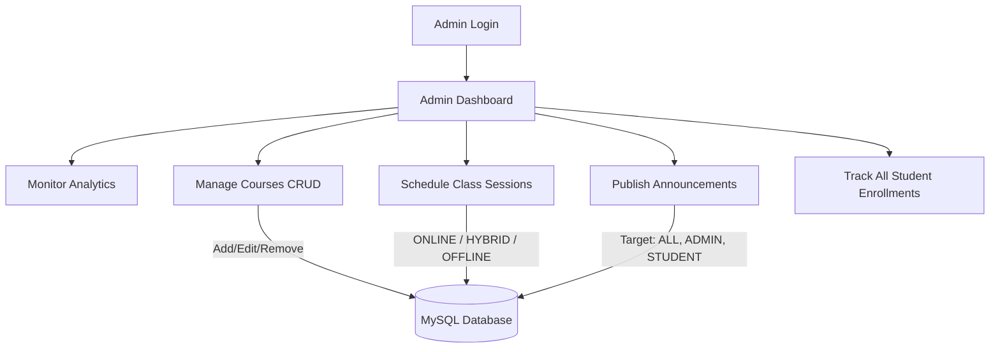
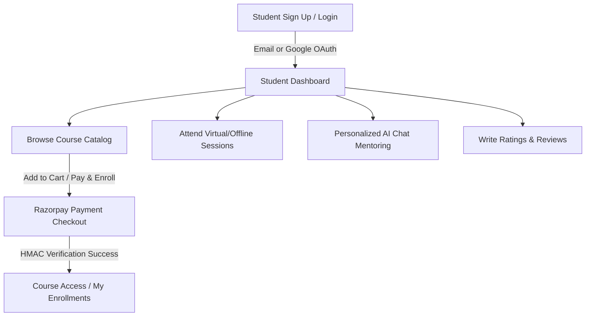

# BinaryStack Coaching Portal — Purpose & Role-Based Workflows

This document outlines the core purpose of the coaching portal, and details the specific workflows and features designed for the two user roles: the **Owner (Admin)** and the **Student**.

---

## 1. Project Purpose & Vision

The **BinaryStack Coaching Portal** is a full-stack Learning Management System (LMS) designed to streamline education management, cohort onboarding, and payment processing. 

### The Problem It Solves:
1.  **Fragmented Operations**: Many coaching institutes manage course listings, scheduling, payments, and announcements across separate, disconnected platforms (e.g., WhatsApp groups, Excel sheets, and external payment links).
2.  **Delayed Feedback & Mentorship**: Students in online batches often experience delayed responses when seeking programming help outside of standard class hours.
3.  **Complex Onboarding & Friction**: Setting up accounts and completing payments for courses often involves manual checkouts, bank transfers, and manual verification steps that delay enrollment.

### The BinaryStack Solution:
*   **Unified Platform**: Consolidates course creation, class scheduling, announcements, and enrollment tracking into a single dashboard.
*   **Secure Paid Enrollments**: Integrates **Razorpay Sandbox** for automated payments (supporting single checkouts and consolidated shopping carts) and uses cryptographic verification on the backend to enroll students instantly upon payment.
*   **On-Demand AI Mentorship**: Provides an AI assistant powered by **OpenRouter**. The assistant personalizes answers based on the student's active courses and target roles, acting as a virtual assistant when human mentors are offline.
*   **Google SSO & Simple Onboarding**: Integrates **Google OAuth 2.0** to reduce registration friction, allowing students to log in quickly and set a local password later.

---

## 2. The Owner's Workflow (Admin Persona)

The Owner/Admin manages the backend portal, schedules sessions, and monitors student activity.

### Key Workflows for the Owner:

#### 1. Operations Dashboard
*   **Metric Monitoring**: View high-level statistics, including the total number of registered students, published courses, and active student enrollments.
*   **System Observability**: Track enrollment trends and monitor course performance.

#### 2. Course Catalog Management (CRUD)
*   **Publishing Courses**: Set titles, detailed descriptions, pricing (free or paid), duration in days, and total hours of instruction.
*   **Modifying Course Details**: Update course contents, adjust prices, or extend cohort durations.
*   **Safe Course Deletion**: Safely delete courses. The backend deletes associated enrollments first to ensure data integrity and prevent foreign key errors.

#### 3. Class Scheduling
*   **Session Configuration**: Set the title, mentor name, start time, end time, and delivery mode:
    *   `ONLINE`: Includes a direct virtual meeting link (e.g., Zoom or Google Meet).
    *   `OFFLINE`: Includes the physical location/classroom address.
    *   `HYBRID`: Includes both meeting links and physical location details.
*   **Timing Validation**: The system ensures the end time is after the start time, preventing scheduling conflicts.

#### 4. Targeted Announcements
*   **Communication Control**: Broadcast news, updates, or exam alerts to the platform.
*   **Audience Targeting**: Select target audiences (`ALL`, `STUDENT` or `ADMIN`) to keep communications relevant and organized.

#### 5. Enrollment Tracking
*   **Registry Monitoring**: View all course enrollments, search for students, and see which cohorts have the highest enrollment numbers.

---

## 3. The Student's Workflow (Student Persona)

The Student is the customer of the portal, discovering cohorts, checking out, attending sessions, and querying the AI assistant.

### Key Workflows for the Student:

#### 1. Registration & Authentication
*   **Onboarding Options**: Register using an email and password, or sign up instantly using **Google OAuth 2.0**.
*   **Profile Personalization**: Complete their profile by adding their city, phone number, education level (e.g., Graduate), and target career roles (e.g., Frontend Engineer) to help customize their learning experience.

#### 2. Course Discovery & Cart Checkouts
*   **Discovery**: Browse all active courses and view details, durations, ratings, and reviews from other students.
*   **Direct Enrollments**: Enroll instantly in free courses.
*   **Razorpay Single Checkout**: Purchase a course by opening the secure Razorpay sandbox gateway and completing the transaction.
*   **Shopping Cart Checkout**: Add multiple courses to their cart and purchase them all at once in a single, consolidated payment.

#### 3. Accessing Course Content
*   **Enrollment Hub**: View active courses, check access expiration dates, and view digital transaction details.
*   **Course Feedback**: Submit ratings (1 to 5 stars) and write reviews for courses they are enrolled in.

#### 4. Attending Classes & Checking Alerts
*   **Class Schedules**: Access the `/student/schedule` page to view upcoming online or hybrid classes, meeting links, and mentor details.
*   **Operational Alerts**: View relevant announcements on the dashboard, keeping them updated on holidays, test changes, or program schedules.

#### 5. Learning with the AI Assistant
*   **AI Tutoring**: Access the `/student/ai-chat` page to ask programming or curriculum questions.
*   **Tailored Mentoring**: The AI dynamically addresses the student by name and provides customized advice based on their education level, target career roles, and active enrolled courses.
